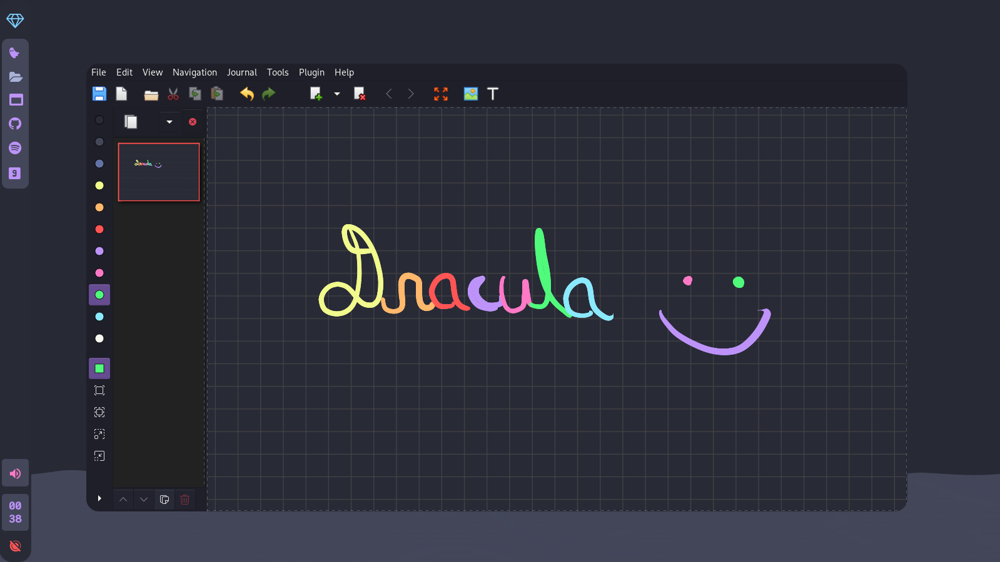

<!-- HEADERS -->
<p align="center">
  
</p>

<p align="center">
  <b> ~ My bspwm rice with dracula theme ~ </b>
</p>


<!-- INFORMATION -->

### Dracula rice with bspwm 




This is my personal collection of configuration files.

The [setup section](#setup) will guide you through the installation process.

Here are some details about my setup:

- **WM:** [bspwm](https://github.com/baskerville/bspwm)
- **OS:** [Arch Linux](https://archlinux.org)
- **Terminal:** [Alacritty](https://github.com/alacritty/alacritty)
- **Shell:** [zsh](https://wiki.archlinux.org/index.php/Zsh)
- **Bar:** [eww](https://github.com/elkowar/eww)
- **Compositor:** [picom](https://github.com/ibhagwan/picom)
- **Editor:** [vscode](https://github.com/microsoft/vscode)
- **Browser:** [firefox developer edition](https://www.mozilla.org/en-US/firefox/developer/)
- **File Manager:** [pcmanfm](https://github.com/lxde/pcmanfm)
- **Application Launcher:** [ulauncher](https://github.com/Ulauncher/Ulauncher)

---

<!-- SETUP -->

## Setup.

> This is step-by-step how to install this config.

### Installation (Manual)

> After cloning the repository, install the necessary dependencies to replicate by setup.

   <details open>
   <summary><strong>Arch Linux (and Arch-based distributions)</strong></summary>

> Assuming your **AUR Helper** is [yay](https://github.com/Jguer/yay).

```sh
 $ yay -S bspwm sxhkd rofi alacritty picom calcurse todotxt \
 feh jq dunst betterlockscreen playerctl maim \
 xclip imagemagick ulauncher firefox-developer-edition  
 pcmanfm xarchiver xournalpp lxappearance font-manager --noconfirm 

```

   </details>

   <br>

> Then after the dependencies are installed, copy the files to it's respective folders.

   <details open>
   <summary><strong>Config and Binaries</strong></summary>

```sh
 $ mkdir -p $HOME/.config/ && cp -r ./config/* $HOME/.config/
 $ mkdir -p $HOME/.local/bin/ && cp -r ./bin/* $HOME/.local/bin/
 $ cp -r ./misc/* $HOME/


```

   </details>

   <br>

> You will need to install a few fonts.

- **JetBrainsMono NF:** [here](https://github.com/ryanoasis/nerd-fonts)
- **Font Awesome:** [here](https://fontawesome.com/download)
- **Comic Mono :** [here](https://dtinth.github.io/comic-mono-font/)

   <br>
<details open>
   <summary><strong>Apply gtk theme, icons and cursor</strong></summary>
   Gtk theme 
<br>

<br>
Icons
<br>

<br>
Cursor
<br>

   </details>

   <br>

> Once finished copying the files, you might want to finalize the changes to your system.

```sh
 # Rebuilds the font cache
 $ fc-cache -fv
```

   <br>

> Lastly, log out from your current desktop session and log in into bspwm.

   <br>

## Acknowledgements.

- **Thanks to**

  - [rxyhn](https://github.com/rxyhn/tokyo) for the inspiration.

   <br>

<p align="center"><a href="https://github.com/rxyhn/bspdots/blob/main/LICENSE"></a></p>
